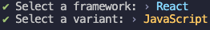
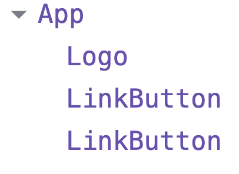

## 리액트 1주차 과제

- [x] JSX 또는 React API를 사용해, Vanilla 프로젝트에서 구현한
      인터페이스의 일부를 마크업하여 웹 브라우저에 렌더링되도록 만듭니다.

### 1. 바닐라 프로젝트 스택

- 시안 : 엔터 이듬 (모바일)
- FE : HTML, Pure CSS, Vanilla Javascript

### 2. 스타트 페이지 선택


### 3. 환경구성

```bash
pnpm create vite week01
pnpm i
```



pnpm 패키지 매니저를 사용하여 vite를 이용한 새로운 프로젝트를 생성

### 4. main.jsx

```jsx
import React from "react";
import ReactDOM from "react-dom/client";
import App from "./app/App";
import "./styles/main.css";

ReactDOM.createRoot(document.getElementById("root")).render(
  <React.StrictMode>
    <App />
  </React.StrictMode>
);
```

### 5. App.jsx

```jsx
import Logo from "../components/Logo/Logo";
import LinkButton from "../components/LinkButton/LinkButton";

import "./App.css";

function App() {
  return (
    <>
      <div className="start-container">
        <Logo />
        <div className="link-container">
          <LinkButton
            className="go-register label-s "
            ariaLabel="회원가입 페이지로 이동"
            href="/"
            style={{ color: "#FFF" }}
          >
            시작하기
          </LinkButton>
          <LinkButton
            className="go-login paragraph-m "
            ariaLabel="로그인 페이지로 이동"
            href="/"
            style={{ color: "#919191" }}
          >
            이미 계정이 있나요? <span className="paragraph-m">로그인</span>
          </LinkButton>
        </div>
      </div>
    </>
  );
}

export default App;
```

- React Developer Tool로 확인한 컴포넌트 구조

  

### 6. LinkButton.jsx

```jsx
import "./LinkButton.css";

function LinkButton({ className, ariaLabel, href, children, style }) {
  return (
    <a className={className} aria-label={ariaLabel} href={href} style={style}>
      {children}
    </a>
  );
}

export default LinkButton;
```

### 7. 이슈

- LinkButton 컴포넌트의 일부 스타일이 적용되지 않는 문제 발생
- '시작하기' 와 '이미 계정이 있나요?' 글자색만 스타일이 적용되지 않음.
- '로그인'의 글자색은 적용이 됨.

### 8. 문제 해결?

  

- 해당 스타일을 인라인으로 넣어주니 글자색 스타일 적용이 되었다.
- 하지만 왜 import한 css파일에서 해당 글자들만 스타일 적용이 되지 않았는지 의문이다.
