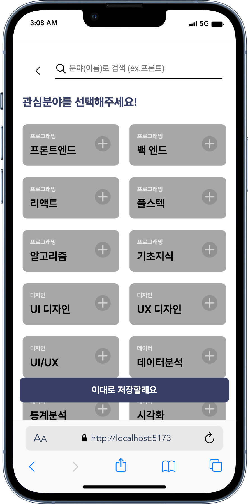
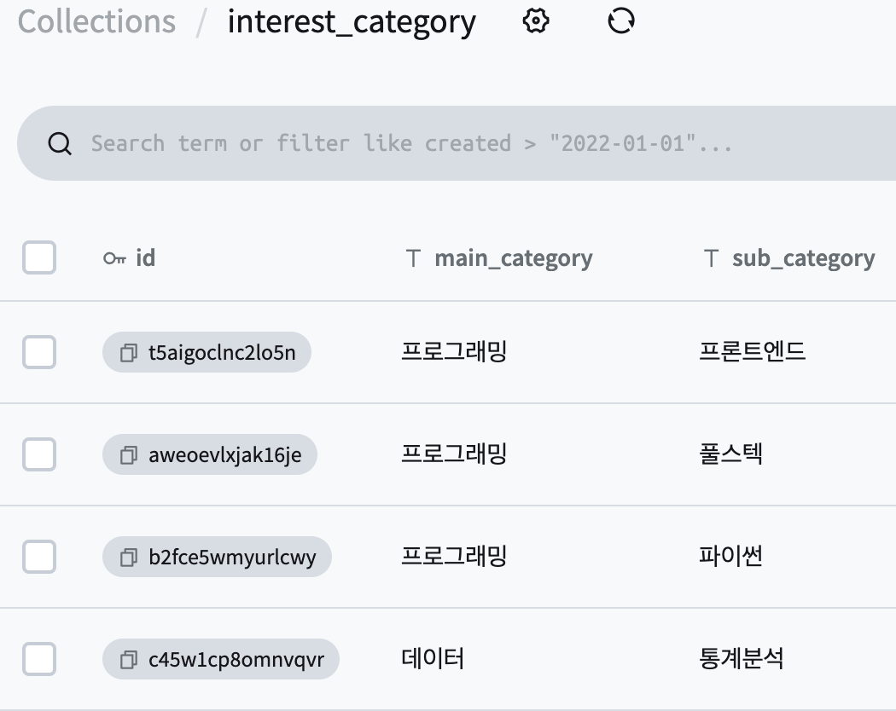

### 리액트 2주차 과제

- [x] 바닐라 프로젝트에서 동적으로 렌더링했던 UI 조각을 선택.
- [x] 바닐라 프로젝트에서 활용했던 데이터베이스의 데이터를 JSON 파일로 로컬 드라이브에 저장.
- [x] JSON 데이터를 불러와 마크업에 연결하여 UI를 구현. 필요한 경우, 리스트 렌더링을 활용.

 **1. 바닐라 프로젝트 개요**
- 엔터 이듬 시안 (모바일)
- vanilla javascript
- pure css

**2. 카테고리 페이지 선택**
- 포켓호스트 DB에서 데이터를 가져와 동적으로 랜더링되던 카테고리 리스트

  
  

