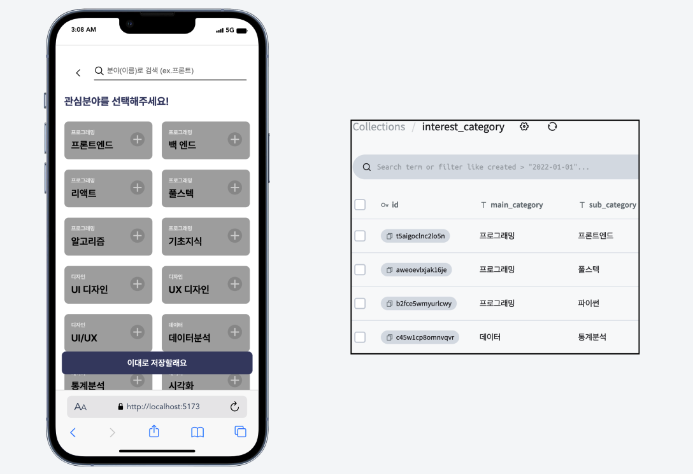
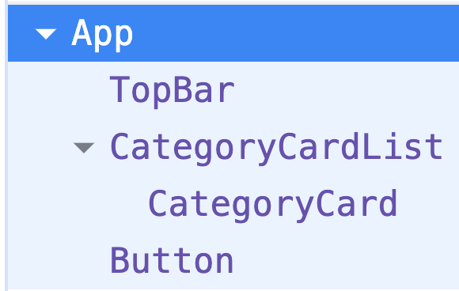
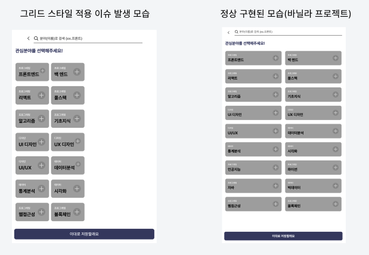
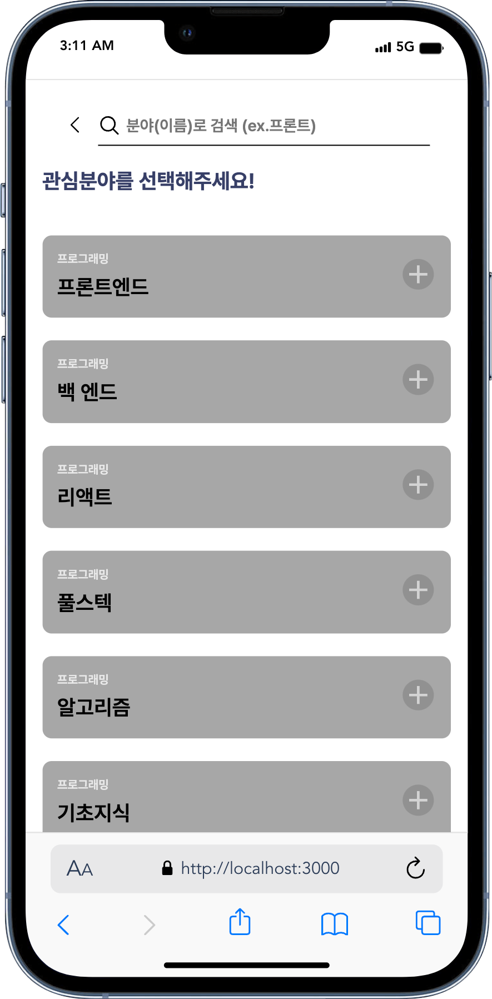

## 리액트 2주차 과제

**요구 사항**

- [x] 바닐라 프로젝트에서 동적으로 렌더링했던 UI 조각을 선택.
- [x] 바닐라 프로젝트에서 활용했던 데이터베이스의 데이터를 JSON 파일로 로컬 드라이브에 저장.
- [x] JSON 데이터를 불러와 마크업에 연결하여 UI를 구현. 필요한 경우, 리스트 렌더링을 활용.

**바닐라 프로젝트 info**

- 시안 : 엔터 이듬 (모바일)
- FE : HTML, Pure CSS, Vanilla Javascript
- DB : PocketHost

**카테고리 리스트 선택**

- 기존 카테고리 리스트는 포켓호스트 DB에서 데이터를 가져와 동적으로 랜더링이 됨.
- 해당 UI 조각을, JSON에서 데이터를 가져와 리스트 랜더링하는 리액트 방식으로 구현할 것.



### 1. App.jsx

```jsx
import TopBar from "../components/TopBar/TopBar";
import Button from "../components/Button/Button";
import {
  CategoryCard,
  CategoryCardList,
} from "../components/CategoryCard/CategoryCard";
import "./App.css";

function App() {
  return (
    <>
      <div className="app">
        <TopBar />
        <h1 className="heading-s">관심분야를 선택해주세요!</h1>
        <div className="category-wrapper">
          <CategoryCardList>
            <CategoryCard />
          </CategoryCardList>
          <Button />
        </div>
      </div>
    </>
  );
}

export default App;
```

- React Developer Tool로 확인한 컴포넌트 구조
  

### 2. category.json

```json
{
  "items": [
    {
      "id": "category-cksd",
      "mainCategory": "프로그래밍",
      "subCategory": "프론트엔드"
    },
    {
      "id": "category-skel",
      "mainCategory": "프로그래밍",
      "subCategory": "백 엔드"
    },
    ...
    {
      "id": "category-qoww",
      "mainCategory": "프로그래밍",
      "subCategory": "웹접근성"
    },
    {
      "id": "category-mnbv",
      "mainCategory": "프로그래밍",
      "subCategory": "블록체인"
    }
  ]
}
```

### 3. CategoryCard.jsx

```jsx
import "./CategoryCard.css";
import plus from "/src/assets/plus.svg";
import categoryData from "../../data/category.json";

console.log(categoryData.items);

export function CategoryCard() {
  const { items } = categoryData;
  const result = items.map(({ id, mainCategory, subCategory }) => {
    return (
      <li key={id}>
        <button type="button" className="category-card">
          <div className="category-name">
            <p className="paragraph-s">{mainCategory}</p>
            <p className="heading-s">{subCategory}</p>
          </div>
          
        </button>
      </li>
    );
  });

  return <ul className="category-list">{result}</ul>;
}

export function CategoryCardList({ children }) {
  return <ul className="category-list">{children}</ul>;
}
```

### 4. 이슈

- 동일한 css 코드를 사용했으나 컴포넌트화 했을시 css가 다르게 랜더링되는 이슈가 발생.
- `.category-list`의 grid가 정상적으로 적용되지 않음.

  

- 원인을 파악하고자 했으나 해결이 안 되어 grid 스타일을 적용시키지 않고 마무리 함.
  ```css
  .category-list {
  /* display: grid;
  place-items: center;
  grid-template-columns: repeat(2,minmax(0,1fr));
  grid-column-gap: 0.5rem; */
  margin-top: 10px;
  padding-bottom: 10px;
  width: 100%;
  ```
- 데이터 바인딩 및 리스트 랜더링을 구현한 과제 모습

  

  ### 5. 과제 소감

  바닐라 프로젝트 때 했던 작업을 리액트 방식으로 다시 다듬는 과정이 재미있었다. 직접 코드 작업을 하니 리액트와 조금은 가까워진 기분.
  데이터 바인딩 및 리스트 랜더링을 직접 구현 해 볼 수 있어서 좋았는데, 예상치 못한 css 스타일 적용 이슈는 꽤나 당황스러웠다.
  이를 해결하지 못해 아쉽고 원인을 알고 싶다.
